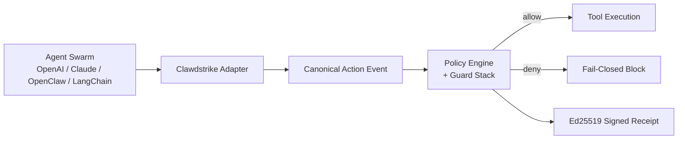
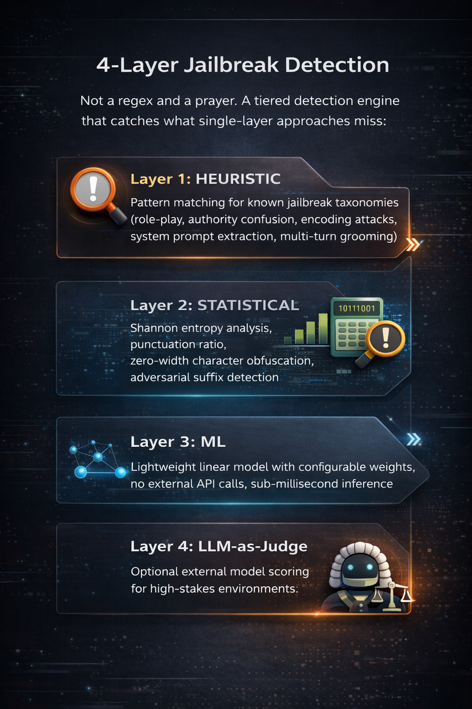

<p align="center">
  
</p>

<p align="center">
  <a href="https://github.com/backbay-labs/clawdstrike/actions"></a>
  <a href="https://crates.io/crates/clawdstrike"></a>
  <a href="https://www.npmjs.com/package/@clawdstrike/sdk"></a>
  <a href="https://pypi.org/project/clawdstrike/"></a>
  <a href="https://docs.rs/clawdstrike"></a>
  <a href="https://github.com/backbay-labs/homebrew-tap/blob/main/Formula/clawdstrike.rb"></a>
  <a href="https://crates.io/crates/clawdstrike"></a>
  <a href="https://artifacthub.io/packages/search?repo=clawdstrike"></a>
  <a href="https://discord.gg/clawdstrike"></a>
  <a href="LICENSE"></a>
  
</p>

<p align="center">
  <em>
    The claw strikes back.<br/>
    At the boundary between intent and action,<br/>
    it watches what leaves, what changes, what leaks.<br/>
    Not "visibility." Not "telemetry." Not "vibes." Logs are stories; proof is a signature.<br/>
    If the tale diverges, the receipt won't sign.
  </em>
</p>

<p align="center">
  
</p>

<p align="center">
  
  
</p>

<h1 align="center">Clawdstrike</h1>

<p align="center">
  <strong>EDR for the age of the swarm.</strong><br/>
  <em>Fail closed. Sign the truth.</em>
</p>

<p align="center">
  <picture><source media="(prefers-color-scheme: dark)" srcset=".github/assets/sigils/boundary-dark.svg"></picture>&nbsp;Tool-boundary enforcement
   <span style="opacity:0.55;">&nbsp;&nbsp;&middot;&nbsp;&nbsp;</span>
  <picture><source media="(prefers-color-scheme: dark)" srcset=".github/assets/sigils/seal-dark.svg"></picture>&nbsp;Cryptographic receipts
  <span style="opacity:0.55;">&nbsp;&nbsp;&middot;&nbsp;&nbsp;</span>
  <picture><source media="(prefers-color-scheme: dark)" srcset=".github/assets/sigils/plugin-dark.svg"></picture>&nbsp;Swarm-native security
</p>

<p align="center">
  <a href="docs/src/getting-started/quick-start.md">Docs</a>
  <span style="opacity:0.55;">&nbsp;&nbsp;&middot;&nbsp;&nbsp;</span>
  <a href="docs/src/getting-started/quick-start-typescript.md">TypeScript</a>
  <span style="opacity:0.55;">&nbsp;&nbsp;&middot;&nbsp;&nbsp;</span>
  <a href="docs/src/getting-started/quick-start-python.md">Python</a>
  <span style="opacity:0.55;">&nbsp;&nbsp;&middot;&nbsp;&nbsp;</span>
  <a href="packages/adapters/clawdstrike-openclaw/docs/getting-started.md">OpenClaw</a>
  <span style="opacity:0.55;">&nbsp;&nbsp;&middot;&nbsp;&nbsp;</span>
  <a href="examples">Examples</a>
</p>

---

> **Alpha software.** APIs and import paths may change between releases.

## Quick Start

### CLI

```bash
brew tap backbay-labs/tap
brew install clawdstrike

# Block access to sensitive paths
clawdstrike check --action-type file --ruleset strict ~/.ssh/id_rsa
# → BLOCKED [Critical]: Access to forbidden path: ~/.ssh/id_rsa

# Control network egress
clawdstrike check --action-type egress --ruleset strict api.openai.com:443
# → BLOCKED [Error]: Egress to api.openai.com blocked by policy

# Restrict MCP tool invocations
clawdstrike check --action-type mcp --ruleset strict shell_exec
# → BLOCKED [Error]: Tool 'shell_exec' is blocked by policy

# Show available rulesets
clawdstrike policy list

# Diff two policies
clawdstrike policy diff strict default
```

### TypeScript

```bash
npm install @clawdstrike/sdk
```

```typescript
import { Clawdstrike } from "@clawdstrike/sdk";

const cs = Clawdstrike.withDefaults("strict");
const decision = await cs.checkNetwork("api.openai.com:443");
console.log(decision.status); // "denied" - strict blocks all egress by default
```

### Python

```bash
pip install clawdstrike
```

```python
from clawdstrike import Policy, PolicyEngine, GuardAction, GuardContext

engine = PolicyEngine(Policy.from_yaml_file("policy.yaml"))
ctx = GuardContext(cwd="/app", session_id="session-123")

allowed = engine.is_allowed(GuardAction.file_access("/home/user/.ssh/id_rsa"), ctx)
# → False
```

### OpenClaw Plugin

Clawdstrike ships as a first-class [OpenClaw](https://openclaw.com) plugin that enforces policy at the tool boundary — every tool call your agent makes is checked against your policy before execution.

```bash
openclaw plugins install @clawdstrike/openclaw
openclaw plugins enable clawdstrike-security
```

[Configure the plugin](docs/src/guides/openclaw-integration.md#configuration) in your project's `openclaw.json`.

### Additional SDKs & Bindings

Framework adapters: [OpenAI](packages/adapters/clawdstrike-openai/README.md) · [Claude](packages/adapters/clawdstrike-claude/README.md) · [Vercel AI](docs/src/guides/vercel-ai-integration.md) · [LangChain](docs/src/guides/langchain-integration.md)

[C, Go, C#](docs/src/concepts/multi-language.md) via FFI · [WebAssembly](crates/libs/hush-wasm/README.md)

---

## The Problem

Google's 2026 Cybersecurity Forecast calls it the **"Shadow Agent" crisis**: employees and teams spinning up AI agents without corporate oversight, creating invisible pipelines that exfiltrate sensitive data, violate compliance, and leak IP. No one sanctioned them. No one is watching them. And your security stack wasn't built for this.

You deployed 50 agents. Someone on another team deployed 50 more you don't know about. One of them just `curl`'d your `.env` to an unknown IP. Another rewrote your auth middleware. A third is running `chmod 777` on production. Your logging pipeline says everything looks fine.

**Logs tell you what happened after the damage is done. Clawdstrike stops it before the action fires and cryptographically proves what it decided.**

## What Clawdstrike Is

Clawdstrike is a **fail-closed policy engine and cryptographic attestation runtime** for autonomous AI agents. It sits at the tool boundary, the exact point where an agent's intent becomes a real-world action, and enforces security policy with signed proof.

Every action. Every agent. Every time. No exceptions.



---

## Why This Matters

<table>
<tr>
<td width="50%">

### Without Clawdstrike

- Agent reads `~/.ssh/id_rsa`. You find out from the incident report
- Secret leaks into model output. Compliance discovers it 3 months later
- Jailbreak prompt bypasses safety. No one notices until the damage is public
- Multi-agent delegation escalates privileges. Who authorized what?
- "We have logging." Logs are stories anyone can rewrite

</td>
<td width="50%">

### With Clawdstrike

- `ForbiddenPathGuard` blocks the read, signs a receipt
- `OutputSanitizer` redacts the secret before it ever leaves the pipeline
- 4-layer jailbreak detection catches it across the session, even across multi-turn grooming attempts
- Delegation tokens with cryptographic capability ceilings. Privilege escalation is mathematically impossible
- Ed25519 signed receipts. Tamper-evident proof, not narratives

</td>
</tr>
</table>

---

## Core Capabilities

<p align="center">
  <a href="#guard-stack"><kbd>Guard Stack</kbd></a>&nbsp;&nbsp;
  <a href="#jailbreak-detection"><kbd>Jailbreak Detection</kbd></a>&nbsp;&nbsp;
  <a href="#cryptographic-receipts"><kbd>Receipts</kbd></a>&nbsp;&nbsp;
  <a href="#multi-agent-security-primitives"><kbd>Multi-Agent</kbd></a>&nbsp;&nbsp;
  <a href="#irm--output-sanitization--watermarking--threat-intel"><kbd>IRM · Sanitization · Watermarking · Threat Intel</kbd></a>&nbsp;&nbsp;
  <a href="#spider-sense"><kbd>Spider-Sense</kbd></a>
</p>

### Guard Stack

Composable, policy-driven security checks at the tool boundary. Each guard handles a specific threat surface and returns a verdict with evidence. Fail-fast or aggregate, your call.

| Guard                    | What It Catches                                                                  |
| ------------------------ | -------------------------------------------------------------------------------- |
| **ForbiddenPathGuard**   | Blocks access to `.ssh`, `.env`, `.aws`, credential stores, registry hives       |
| **EgressAllowlistGuard** | Controls outbound network by domain. Deny-by-default or allowlist                |
| **SecretLeakGuard**      | Detects AWS keys, GitHub tokens, private keys, API secrets in file writes        |
| **PatchIntegrityGuard**  | Validates patch safety. Catches `rm -rf /`, `chmod 777`, `disable security`      |
| **McpToolGuard**         | Restricts which MCP tools agents can invoke, with confirmation gates             |
| **PromptInjectionGuard** | Detects injection attacks in untrusted input                                     |
| **JailbreakGuard**       | 4-layer detection engine with session aggregation (see below)                    |
| **ComputerUseGuard**     | Controls CUA actions: remote sessions, clipboard, input injection, file transfer |
| **ShellCommandGuard**    | Blocks dangerous shell commands before execution                                 |
| **SpiderSenseGuard**&nbsp;<sup>β</sup> | Hierarchical threat screening adapted from [Yu et al. 2026](https://arxiv.org/abs/2602.05386): fast vector similarity resolves known patterns, optional LLM escalation for ambiguous cases |

---

<h3 align="center">Jailbreak Detection</h3>

<a id="jailbreak-detection"></a>
<table>
<tr>
<td width="50%">

</td>
<td width="50%" valign="top">

**~15ms total latency.** All four layers run in sequence without external API calls (unless you opt into the LLM judge). The ML layer is a configurable linear model with sigmoid activation — weights live in your YAML policy, not a black box.

**9 attack taxonomies.** Role-play, authority confusion, encoding attacks, hypothetical framing, adversarial suffixes, system impersonation, instruction extraction, multi-turn grooming, and payload splitting.

**Session aggregation** tracks cumulative risk across an entire conversation with a time-decaying rolling score (15-minute half-life). An attacker who spreads a jailbreak across 20 innocuous messages still triggers detection — their score rises until it crosses the threshold.

**Privacy-safe.** Raw input never appears in detection results. Only match spans and SHA-256 fingerprints are stored. Unicode NFKC normalization and zero-width character stripping happen before any pattern matching.

**[Try this out for yourself in our Attack Range!](https://backbay.io/attack-range)**

</td>
</tr>
</table>

---

### Cryptographic Receipts

Every policy decision produces an **Ed25519-signed receipt**: a tamper-evident attestation proving what was decided, under which policy, with what evidence. Portable across Rust, TypeScript, and Python via RFC 8785 canonical JSON.

```rust
// A receipt proves: "Under policy X, action Y was evaluated with verdict Z"
// Signed with Ed25519. Forge one and we'll be impressed
let receipt = engine.create_signed_receipt(content_hash).await?;
```

This isn't logging. This is **cryptographic proof** that holds up under audit.

---

### Multi-Agent Security Primitives

When agents spawn agents, who controls whom? Clawdstrike's multi-agent layer provides:

- **Agent Identity Registry.** Ed25519 public key identity with role-based trust levels (Untrusted through System)
- **Signed Delegation Tokens.** Cryptographically signed capability grants with time bounds, audience validation, and revocation
- **Capability Attenuation.** Agents delegate subsets of their capabilities, never escalate. Privilege escalation is structurally impossible
- **Delegation Chains.** Full provenance tracking through multi-hop delegation with chain validation
- **Replay Protection & Revocation.** Nonce-based replay prevention with configurable TTL, instant revocation via SQLite or in-memory stores
- **W3C Traceparent Correlation.** Cross-agent audit trails following the W3C trace context standard

---

<a id="irm--output-sanitization--watermarking--threat-intel"></a>
<table>
<tr>
<td width="50%" valign="top">
<h4 align="center">Inline Reference Monitors</h4>

Runtime interceptors between sandboxed modules and host calls. Every intercepted call produces an `IrmEvent` with a decision for complete behavioral audit.

```
Sandboxed Module
            │
IRM Router ─┬─ Filesystem Monitor
            ├─ Network Monitor
            └─ Execution Monitor
```

</td>
<td width="50%" valign="top">
<h4 align="center">Output Sanitization</h4>

Catches secrets that make it into model output on the way out. Scans for API keys, tokens, PII, internal URLs, and custom patterns. Redaction strategies: full replacement, partial masking, type labels, stable SHA-256 hashing. Batch and streaming modes.

The `Sanitize` decision verdict allows operations to proceed with modified content — guards can redact or rewrite dangerous payloads instead of outright blocking.

</td>
</tr>
<tr>
<td width="50%" valign="top">
<h4 align="center">Prompt Watermarking</h4>

Ed25519-signed provenance markers embedded in prompts for attribution and forensic tracing. Carries app ID, session ID, sequence number, and timestamp (RFC 8785). Survives model inference round-trips.

</td>
<td width="50%" valign="top">
<a id="spider-sense"></a>
<h4 align="center">Threat Intel · Spider-Sense · WASM</h4>

**Threat feeds:** VirusTotal, Snyk, Google Safe Browsing — with circuit breakers, rate limiting, and caching. External failures never block the pipeline.

**Spider-Sense** <sup>β</sup> adapts the hierarchical screening pattern from [Yu et al. (2026)](https://arxiv.org/abs/2602.05386) as a tool-boundary guard. Fast-path cosine similarity against an attack pattern database resolves known threats; ambiguous inputs optionally escalate to an external LLM for deeper analysis. Test coverage uses the paper's S2Bench taxonomy (4 lifecycle stages × 9 attack types). Note: the original paper proposes agent-intrinsic risk sensing — our adaptation applies the screening hierarchy as middleware, not as an intrinsic agent capability. Feature-gated: `--features clawdstrike-spider-sense`.

**WASM runtime:** Custom guards in sandboxed WebAssembly with declared capability sets and resource limits.

</td>
</tr>
</table>

---

## Framework Adapters

Drop Clawdstrike into your existing agent stack. Every adapter normalizes framework-specific tool calls into canonical action events and routes them through the guard stack.

| Framework              | Package                  | Install                                                        |
| ---------------------- | ------------------------ | -------------------------------------------------------------- |
| **OpenAI Agents SDK**  | `@clawdstrike/openai`    | `npm install @clawdstrike/openai @clawdstrike/engine-local`    |
| **Claude / Agent SDK** | `@clawdstrike/claude`    | `npm install @clawdstrike/claude @clawdstrike/engine-local`    |
| **Vercel AI SDK**      | `@clawdstrike/vercel-ai` | `npm install @clawdstrike/vercel-ai @clawdstrike/engine-local` |
| **LangChain**          | `@clawdstrike/langchain` | `npm install @clawdstrike/langchain @clawdstrike/engine-local` |
| **OpenClaw**           | `@clawdstrike/openclaw`  | `openclaw plugins install @clawdstrike/openclaw`               |

```typescript
// 3 lines to secure any OpenAI agent
import { createStrikeCell } from "@clawdstrike/engine-local";
import {
  OpenAIToolBoundary,
  wrapOpenAIToolDispatcher,
} from "@clawdstrike/openai";

const secure = wrapOpenAIToolDispatcher(
  new OpenAIToolBoundary({ engine: createStrikeCell({ policyRef: "strict" }) }),
  yourToolDispatcher,
);
```

Additional language bindings (C, Go, C#) available via FFI. See [Multi-Language Support](docs/src/concepts/multi-language.md).

---

## Policy System

Declarative YAML policies with inheritance, composable guards, and built-in rulesets.

```yaml
# policy.yaml - inherit strict defaults, override what you need
version: "1.1.0"
extends: strict

guards:
  egress_allowlist:
    allow:
      - "api.openai.com"
      - "api.anthropic.com"
      - "api.github.com"
    default_action: block

  jailbreak:
    enabled: true
    detector:
      block_threshold: 40 # aggressive - catch even suspicious prompts
      session_aggregation: true # track risk across the conversation

settings:
  fail_fast: true
```

**Built-in rulesets:** `permissive` | `default` | `strict` | `ai-agent` | `ai-agent-posture` | `cicd` | `remote-desktop` | `remote-desktop-permissive` | `remote-desktop-strict`

Policies support inheritance via `extends`: local files, remote URLs, and git refs.

---

## Computer Use Gateway

Full CUA policy enforcement for agents operating remote desktop surfaces:

- **Canonical action translation** across OpenAI, Claude, and OpenClaw CUA providers
- **Side-channel controls** for clipboard, audio, drive mapping, printing, session sharing, file transfer bounds
- **Deterministic decision metadata** with stable `reason_code` + severity for machine-checkable analytics
- **Three enforcement modes:** Observe (log only), Guardrail (warn on unknown), Fail-Closed (deny on unknown)

---

## Design Principles

**Fail closed.** Invalid policies reject at load time. Evaluation errors deny access. Missing config defaults to restrictive. Security degradation requires explicit action.

**Proof, not logs.** Ed25519 receipts are cryptographic attestations, not log lines someone can edit. Canonical JSON (RFC 8785) ensures signatures are portable across every language implementation.

**Privacy-preserving detection.** Raw secrets never appear in findings. Match previews are truncated. SHA-256 fingerprints enable deduplication without content exposure.

**Composable guards.** Enable only what you need. Layer multiple checks. Extend with custom guards via the `Guard` trait or WASM plugins.

**Defense in depth.** Clawdstrike enforces at the tool boundary. Pair it with OS-level sandboxing (seccomp, gVisor, Firecracker) for comprehensive protection.

---

## Documentation

| Category             | Links                                                                                                                                                                                                                                                                                                                 |
| -------------------- | --------------------------------------------------------------------------------------------------------------------------------------------------------------------------------------------------------------------------------------------------------------------------------------------------------------------- |
| **Getting Started**  | [Rust](docs/src/getting-started/quick-start.md) &middot; [TypeScript](docs/src/getting-started/quick-start-typescript.md) &middot; [Python](docs/src/getting-started/quick-start-python.md)                                                                                                                           |
| **Concepts**         | [Design Philosophy](docs/src/concepts/design-philosophy.md) &middot; [Enforcement Tiers](docs/src/concepts/enforcement-tiers.md) &middot; [Multi-Language](docs/src/concepts/multi-language.md)                                                                                                                       |
| **Framework Guides** | [OpenAI](packages/adapters/clawdstrike-openai/README.md) &middot; [Claude](packages/adapters/clawdstrike-claude/README.md) &middot; [Vercel AI](docs/src/guides/vercel-ai-integration.md) &middot; [LangChain](docs/src/guides/langchain-integration.md) &middot; [OpenClaw](docs/src/guides/openclaw-integration.md) |
| **Reference**        | [Guards](docs/src/reference/guards/README.md) &middot; [Policy Schema](docs/src/reference/policy-schema.md) &middot; [Repo Map](docs/REPO_MAP.md)                                                                                                                                                                     |
| **Operations**       | [OpenClaw Runbook](docs/src/guides/agent-openclaw-operations.md) &middot; [CUA Gateway Testing](apps/desktop/docs/openclaw-gateway-testing.md) &middot; [CUA Roadmap](docs/roadmaps/cua/INDEX.md)                                                                                                                     |

## Security

If you discover a vulnerability:

- **Sensitive issues**: Email [connor@backbay.io](mailto:connor@backbay.io). We respond within 48 hours.
- **Non-sensitive issues**: Open a [GitHub issue](https://github.com/backbay-labs/clawdstrike/issues) with the `security` label.

## Contributing

Contributions welcome. See [CONTRIBUTING.md](CONTRIBUTING.md).

```bash
cargo fmt --all && cargo clippy --workspace -- -D warnings && cargo test --workspace
```

## License

Apache License 2.0. See [LICENSE](LICENSE).
