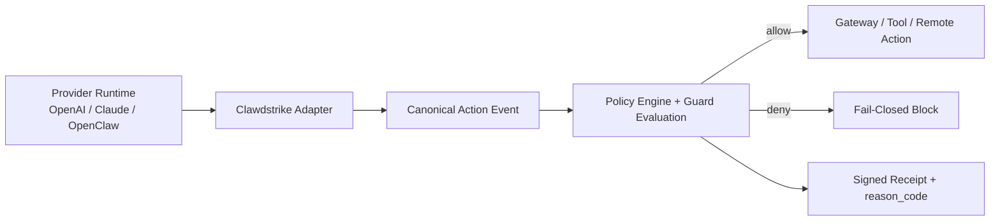

<p align="center">
  
</p>

<p align="center">
  <a href="https://github.com/backbay-labs/clawdstrike/actions"></a>
  <a href="https://crates.io/crates/clawdstrike"></a>
  <a href="https://docs.rs/clawdstrike"></a>
  <a href="https://artifacthub.io/packages/search?repo=clawdstrike"></a>
  <a href="LICENSE"></a>
  
</p>

<p align="center">
  <em>
    The claw strikes back.<br/>
    At the boundary between intent and action,<br/>
    it watches what leaves, what changes, what leaks.<br/>
    Not "visibility." Not “telemetry.” Not "vibes." Logs are stories—proof is a signature.<br/>
    If the tale diverges, the receipt won't sign.
  </em>
</p>

<p align="center">
  
</p>

<p align="center">
  
  
</p>

<h1 align="center">Clawdstrike</h1>

<p align="center">
  <em>Fail closed. Sign the truth.</em>
</p>

<p align="center">
  <picture><source media="(prefers-color-scheme: dark)" srcset=".github/assets/sigils/boundary-dark.svg"></picture>&nbsp;Tool-boundary enforcement
   <span style="opacity:0.55;">&nbsp;&nbsp;&middot;&nbsp;&nbsp;</span>
  <picture><source media="(prefers-color-scheme: dark)" srcset=".github/assets/sigils/seal-dark.svg"></picture>&nbsp;Signed receipts
  <span style="opacity:0.55;">&nbsp;&nbsp;&middot;&nbsp;&nbsp;</span>
  <picture><source media="(prefers-color-scheme: dark)" srcset=".github/assets/sigils/plugin-dark.svg"></picture>&nbsp;Multi-framework
</p>

<p align="center">
  <a href="docs/src/getting-started/quick-start.md">Docs</a>
  <span style="opacity:0.55;">&nbsp;&nbsp;&middot;&nbsp;&nbsp;</span>
  <a href="docs/src/getting-started/quick-start-typescript.md">TypeScript</a>
  <span style="opacity:0.55;">&nbsp;&nbsp;&middot;&nbsp;&nbsp;</span>
  <a href="docs/src/getting-started/quick-start-python.md">Python</a>
  <span style="opacity:0.55;">&nbsp;&nbsp;&middot;&nbsp;&nbsp;</span>
  <a href="packages/adapters/clawdstrike-openclaw/docs/getting-started.md">OpenClaw</a>
  <span style="opacity:0.55;">&nbsp;&nbsp;&middot;&nbsp;&nbsp;</span>
  <a href="examples">Examples</a>
</p>

---

## Overview

> **Alpha software** — APIs and import paths may change between releases. See GitHub Releases and the package registries (crates.io / npm / PyPI) for published versions.

Clawdstrike is a fail-closed policy + attestation runtime for AI agents and computer-use systems, designed for developers building EDR solutions and security infrastructure for autonomous agent swarms. It sits at the boundary between intent and execution: normalize actions, enforce policy, and sign what happened.

 **Guards** — Block sensitive paths, control network egress, detect secrets, validate patches, restrict tools, catch jailbreaks

 **Receipts** — Ed25519-signed attestations proving what was decided, under which policy, with what evidence

 **Multi-language** — Rust, TypeScript, Python, WebAssembly

 **Multi-framework** — OpenClaw, Vercel AI, LangChain, Claude, OpenAI, and more

## Computer Use Gateway

Clawdstrike now includes dedicated CUA gateway coverage for real runtime paths (not just static policy checks):

- Canonical CUA action translation across providers/runtimes.
- Side-channel policy controls for remote desktop surfaces (`clipboard`, `audio`, `drive_mapping`, `printing`, `session_share`, file transfer bounds).
- Deterministic decision metadata (`reason_code`, guard, severity) for machine-checkable analytics.
- Fixture-driven validator suites plus runtime bridge tests for regression safety.

## Architecture At A Glance



## Quick Start

Pick one core runtime, then add the adapter for your framework.

### Core Runtimes

#### Rust CLI

```bash
# from crates.io (recommended when published)
cargo install hush-cli

clawdstrike policy list
clawdstrike check --action-type file --ruleset strict ~/.ssh/id_rsa
```

```bash
# from source checkout (development path)
cargo install --path crates/services/hush-cli
```

Docs: [Quick Start (Rust)](docs/src/getting-started/quick-start.md)

#### TypeScript SDK (`@clawdstrike/sdk`)

```bash
npm install @clawdstrike/sdk
```

```typescript
import { Clawdstrike } from "@clawdstrike/sdk";

const cs = Clawdstrike.withDefaults("strict");
const decision = await cs.checkNetwork("api.openai.com:443");
console.log(decision.status);
```

Docs: [Quick Start (TypeScript)](docs/src/getting-started/quick-start-typescript.md)

#### Python SDK (`clawdstrike`)

```bash
pip install clawdstrike
```

```python
from clawdstrike import Policy, PolicyEngine, GuardAction, GuardContext

policy = Policy.from_yaml_file("policy.yaml")
engine = PolicyEngine(policy)
ctx = GuardContext(cwd="/app", session_id="session-123")

allowed = engine.is_allowed(GuardAction.file_access("/home/user/.ssh/id_rsa"), ctx)
print("allowed:", allowed)
```

Docs: [Quick Start (Python)](docs/src/getting-started/quick-start-python.md)

### Additional Language Bindings (Advanced / FFI)

These bindings are useful for native/runtime integrations and receipt/crypto flows.
They currently rely on the `hush-ffi` native library (`libhush_ffi`).

#### C (via `hush-ffi`)

```bash
cargo build -p hush-ffi --release
```

- Header: `crates/libs/hush-ffi/hush.h`
- Native library output: `target/release/` (`libhush_ffi.*`)

#### Go (via cgo binding)

```bash
# optional local-development pin
go mod edit -replace github.com/backbay-labs/clawdstrike/packages/sdk/hush-go=/path/to/clawdstrike/packages/sdk/hush-go
go get github.com/backbay-labs/clawdstrike/packages/sdk/hush-go
```

```go
import hush "github.com/backbay-labs/clawdstrike/packages/sdk/hush-go"

v := hush.Version()
_ = v
```

#### C# (.NET binding)

```bash
dotnet add <your-project>.csproj reference /path/to/clawdstrike/packages/sdk/hush-csharp/src/Hush/Hush.csproj
```

```csharp
using Hush;
using Hush.Crypto;

var kp = Keypair.Generate();
Console.WriteLine(kp.PublicKeyHex);
```

For Go/C#/C runtime setup, ensure `libhush_ffi` is on your dynamic library path.

### Framework Adapters

#### OpenAI Agents SDK (`@clawdstrike/openai`)

```bash
npm install @clawdstrike/openai @clawdstrike/adapter-core @clawdstrike/engine-local
```

```typescript
import { createStrikeCell } from "@clawdstrike/engine-local";
import { OpenAIToolBoundary, wrapOpenAIToolDispatcher } from "@clawdstrike/openai";

const boundary = new OpenAIToolBoundary({ engine: createStrikeCell({ policyRef: "default" }) });
const dispatchTool = wrapOpenAIToolDispatcher(boundary, async (toolName, input, runId) => {
  return { toolName, input, runId };
});
```

Docs: [OpenAI Adapter README](packages/adapters/clawdstrike-openai/README.md)

#### Claude Code / Claude Agent SDK (`@clawdstrike/claude`)

```bash
npm install @clawdstrike/claude @clawdstrike/adapter-core @clawdstrike/engine-local
```

```typescript
import { createStrikeCell } from "@clawdstrike/engine-local";
import { ClaudeToolBoundary, wrapClaudeToolDispatcher } from "@clawdstrike/claude";

const boundary = new ClaudeToolBoundary({ engine: createStrikeCell({ policyRef: "default" }) });
const dispatchTool = wrapClaudeToolDispatcher(boundary, async (toolName, input, runId) => {
  return { toolName, input, runId };
});
```

Docs: [Claude Adapter README](packages/adapters/clawdstrike-claude/README.md), [Claude Recipe](docs/src/recipes/claude.md)

#### Vercel AI SDK (`@clawdstrike/vercel-ai`)

```bash
npm install @clawdstrike/vercel-ai @clawdstrike/engine-local ai
```

```typescript
import { createStrikeCell } from "@clawdstrike/engine-local";
import { createVercelAiInterceptor, secureTools } from "@clawdstrike/vercel-ai";

const interceptor = createVercelAiInterceptor(createStrikeCell({ policyRef: "default" }));
const tools = secureTools(
  { bash: { async execute(input: { cmd: string }) { return input.cmd; } } },
  interceptor,
);
```

Docs: [Vercel AI Integration Guide](docs/src/guides/vercel-ai-integration.md)

#### LangChain (`@clawdstrike/langchain`)

```bash
npm install @clawdstrike/langchain @clawdstrike/adapter-core @clawdstrike/engine-local
```

```typescript
import { createStrikeCell } from "@clawdstrike/engine-local";
import { BaseToolInterceptor } from "@clawdstrike/adapter-core";
import { wrapTool } from "@clawdstrike/langchain";

const interceptor = new BaseToolInterceptor(createStrikeCell({ policyRef: "default" }));
const secureTool = wrapTool({ name: "bash", async invoke(input: { cmd: string }) { return input.cmd; } }, interceptor);
```

Docs: [LangChain Integration Guide](docs/src/guides/langchain-integration.md)

#### OpenClaw Plugin (`@clawdstrike/openclaw`)

```bash
# published package workflow (recommended)
openclaw plugins install @clawdstrike/openclaw

# local development workflow
openclaw plugins install --link /path/to/clawdstrike/packages/adapters/clawdstrike-openclaw
openclaw plugins enable clawdstrike-security
```

Docs: [OpenClaw Plugin Quick Start](packages/adapters/clawdstrike-openclaw/docs/getting-started.md), [OpenClaw Integration Guide](docs/src/guides/openclaw-integration.md)

### Computer Use Gateway (Production Onboarding)

Use the agent-owned OpenClaw architecture in production:

1. Install a release build of Clawdstrike Agent/Desktop.
2. Configure OpenClaw gateways (URL + token) in OpenClaw Fleet or via the local agent API.
3. Validate gateway/session health through the agent health and gateway endpoints.

Operational docs:
- [Agent OpenClaw Operations Runbook](docs/src/guides/agent-openclaw-operations.md)
- [OpenClaw Gateway Testing Guide](apps/desktop/docs/openclaw-gateway-testing.md)

## Highlights

| Feature | Description |
| --- | --- |
| **Computer Use Gateway Controls** | Canonical CUA policy evaluation for click/type/scroll/key-chord and remote side-channel actions |
| **Provider Translation Layer** | Runtime translators for OpenAI/Claude/OpenClaw flows into a unified policy surface |
| **7 Built-in Guards** | Path, egress, secrets, patches, tools, prompt injection, jailbreak |
| **4-Layer Jailbreak Detection** | Heuristic + statistical + ML + optional LLM-as-judge with session aggregation |
| **Deterministic Decisions** | Stable `reason_code` + severity metadata for enforcement analytics and regression checks |
| **Fail-Closed Design** | Invalid policies reject at load time; evaluation errors deny access |
| **Signed Receipts** | Tamper-evident audit trail with Ed25519 signatures |
| **Output Sanitization** | Redact secrets/PII/internal data from model output with streaming support |
| **Prompt Watermarking** | Embed signed provenance markers for attribution and forensics |

## Performance

Guard checks add **<0.05ms** overhead per tool call. For context, typical LLM API calls take 500-2000ms.

| Operation | Latency | % of LLM call |
|-----------|---------|---------------|
| Single guard check | <0.001ms | <0.0001% |
| Full policy evaluation | ~0.04ms | ~0.004% |
| Jailbreak detection (heuristic+statistical) | ~0.03ms | ~0.003% |

No external API calls required for core detection. [Full benchmarks →](docs/src/reference/benchmarks.md)

## Documentation

- [Quick Start (Rust)](docs/src/getting-started/quick-start.md)
- [Quick Start (TypeScript)](docs/src/getting-started/quick-start-typescript.md)
- [Quick Start (Python)](docs/src/getting-started/quick-start-python.md)
- [Multi-Language Support Matrix](docs/src/concepts/multi-language.md)
- [OpenAI Adapter](packages/adapters/clawdstrike-openai/README.md)
- [Claude Adapter](packages/adapters/clawdstrike-claude/README.md)
- [Vercel AI Integration Guide](docs/src/guides/vercel-ai-integration.md)
- [LangChain Integration Guide](docs/src/guides/langchain-integration.md)
- [OpenClaw Integration Guide](docs/src/guides/openclaw-integration.md)
- [Agent OpenClaw Operations Runbook](docs/src/guides/agent-openclaw-operations.md)
- [OpenClaw Gateway Testing Guide](apps/desktop/docs/openclaw-gateway-testing.md)
- [CUA Roadmap Index](docs/roadmaps/cua/INDEX.md)
- [Design Philosophy](docs/src/concepts/design-philosophy.md)
- [Enforcement Tiers & Integration Contract](docs/src/concepts/enforcement-tiers.md)
- [Guards Reference](docs/src/reference/guards/README.md)
- [Policy Schema](docs/src/reference/policy-schema.md)
- [Repository Map](docs/REPO_MAP.md)
- [Documentation Map](docs/DOCS_MAP.md)

## Security

We take security seriously. If you discover a vulnerability:

- **For sensitive issues**: Email [connor@backbay.io](mailto:connor@backbay.io) with details. We aim to respond within 48 hours.
- **For non-sensitive issues**: Open a [GitHub issue](https://github.com/backbay-labs/clawdstrike/issues) with the `security` label.

## Contributing

Contributions welcome! See [CONTRIBUTING.md](CONTRIBUTING.md) for guidelines.

```bash
cargo build && cargo test && cargo clippy
```

## License

Apache License 2.0 - see [LICENSE](LICENSE) for details.
